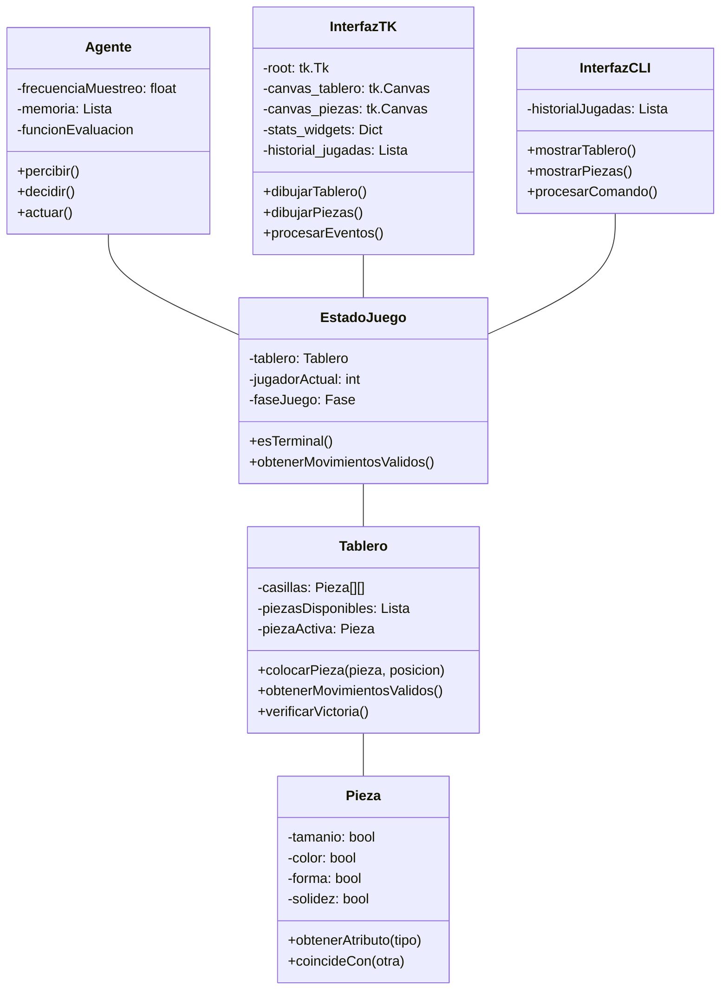

# Plan de Implementación del Agente para el Juego Quarto

## 1. Descripción General

Este documento describe el plan de implementación de un agente jugador de Quarto usando técnicas de búsqueda adversarial, incluyendo interfaces gráfica (Tkinter) y de línea de comandos.

## 2. Componentes Principales

### 2.1 Estructura de Clases



## 3. Diseño del Agente

### 3.1 Tipo de Agente
- **Clasificación Principal**: Agente Proactivo
- **Clasificación Secundaria**: Agente basado en Objetivos
  - Utiliza minimax con poda alfa-beta
  - Mantiene representación interna del estado
  - Evalúa estados futuros para lograr victoria

### 3.2 Características del Entorno
1. **Accesibilidad**: Accesible
   - Estado completo del tablero visible
   - Atributos de todas las piezas conocidos
   - Fase actual del juego clara

2. **Determinismo**: Determinista
   - Acciones tienen resultados predecibles
   - Sin elementos aleatorios

3. **Estructura de Episodios**: Secuencial
   - Movimientos pasados afectan estados futuros
   - Historia del juego impacta decisiones

4. **Dinamismo**: Estático
   - Entorno solo cambia por acciones del agente/oponente
   - Sin cambios dependientes del tiempo

5. **Espacio de Estados**: Discreto
   - Posiciones finitas (4x4)
   - Combinaciones finitas de piezas
   - Condiciones de victoria claras

## 4. Interfaces de Usuario

### 4.1 Interfaz Gráfica (Tkinter)
1. **Componentes Visuales**
   - Panel izquierdo: Tablero 4x4
   - Panel central: Piezas disponibles y log
   - Panel derecho: Estado y estadísticas
   - Indicadores de fase y turno
   - Estadísticas en tiempo real

2. **Interacción**
   - Selección de piezas con mouse
   - Colocación en tablero con click
   - Feedback visual de hover y selección
   - Botones para reiniciar/salir

3. **Elementos de la Interfaz**
```python
class InterfazTK:
    def __init__(self):
        self.root = None
        self.canvas_tablero = None
        self.canvas_piezas = None
        self.stats_widgets = {}
        self.historial_jugadas = []
        
    def _dibujar_tablero(self):
        """Renderiza el tablero 4x4 y piezas"""
        
    def _dibujar_piezas(self):
        """Muestra piezas disponibles"""
        
    def _update_info(self):
        """Actualiza estado e indicadores"""
```

### 4.2 Interfaz CLI
1. **Visualización**
   - Representación ASCII del tablero
   - Lista numerada de piezas disponibles
   - Historial de movimientos
   - Estado actual del juego

2. **Comandos**
   - `colocar X Y`: Coloca pieza en coordenadas
   - `seleccionar N`: Elige pieza número N
   - `mostrar`: Actualiza visualización
   - `salir`: Termina el juego

## 5. Sensores y Percepciones

### 5.1 Sensores
1. **Sensor de Tablero**
   - Lee posiciones actuales
   - Actualiza matriz 4x4
   - Frecuencia: T segundos (configurable)

2. **Seguidor de Piezas**
   - Monitorea piezas disponibles
   - Rastrea atributos
   - Actualiza después de cada colocación

### 5.2 Percepciones
1. **Estructura**
   - Matriz de estado del tablero (4x4)
   - Lista de piezas disponibles
   - Pieza activa actual
   - Fase actual del juego

2. **Muestreo**
   - Frecuencia: 1/T Hz (configurable)
   - Canales: 3 (tablero, piezas, fase)

## 6. Monitoreo y Estadísticas

### 6.1 Estadísticas en Tiempo Real
- Decisiones tomadas
- Tiempo promedio de decisión
- Nodos explorados
- Podas realizadas

### 6.2 Capturas y Logs
- Screenshots automáticos (opcional)
- Registro de jugadas en archivo log
- Estadísticas finales en archivo

## 7. Estructura de Archivos

```
quarto/
├── src/
│   ├── juego/
│   │   ├── __init__.py
│   │   ├── tablero.py
│   │   ├── pieza.py
│   │   └── estado.py
│   ├── agente/
│   │   ├── __init__.py
│   │   └── agente.py
│   ├── interfaces/
│   │   ├── __init__.py
│   │   ├── tk_gui.py
│   │   └── cli.py
│   └── utils/
│       ├── __init__.py
│       └── constantes.py
├── tests/
│   ├── test_juego.py
│   ├── test_agente.py
│   └── test_interfaces.py
├── README.md
└── requirements.txt
```

## 8. Dependencias

1. **Bibliotecas Requeridas**
   - Tkinter: Interfaz gráfica
   - PIL: Capturas de pantalla
   - Time: Control de muestreo
   - Logging: Seguimiento de rendimiento

2. **Herramientas de Desarrollo**
   - Python 3.8+
   - pytest
   - Black (formateo)
   - pylint (calidad de código)

## 9. Secuencia de Implementación

### 9.1 Fase 1: Lógica Base
1. Implementación del Tablero
2. Clase Pieza con atributos
3. Gestión básica de estado
4. Verificación de victoria

### 9.2 Fase 2: Interfaces
1. Implementación CLI
2. Implementación GUI con Tkinter
3. Sistema de estadísticas integrado
4. Capturas y logs

### 9.3 Fase 3: Agente
1. Sistema de percepción
2. Validación de acciones
3. Representación de estado
4. Toma de decisiones

### 9.4 Fase 4: Optimización
1. Eficiencia de memoria
2. Poda de búsqueda
3. Ajuste de heurísticas
4. Métricas de rendimiento

## 10. Configuración por Defecto

### 10.1 Parámetros de Inicio
1. Modo: Interfaz Tkinter
2. Primer jugador: Humano
3. Frecuencia del agente: 1.0 Hz
4. Capturas habilitadas

### 10.2 Almacenamiento
1. Directorio base: `juegos/`
2. Subdirectorios por partida: `ddmm-hhmmss/`
3. Archivos guardados:
   - Capturas: `N.png`
   - Log: `log.txt`
   - Estadísticas: `stats.txt`
